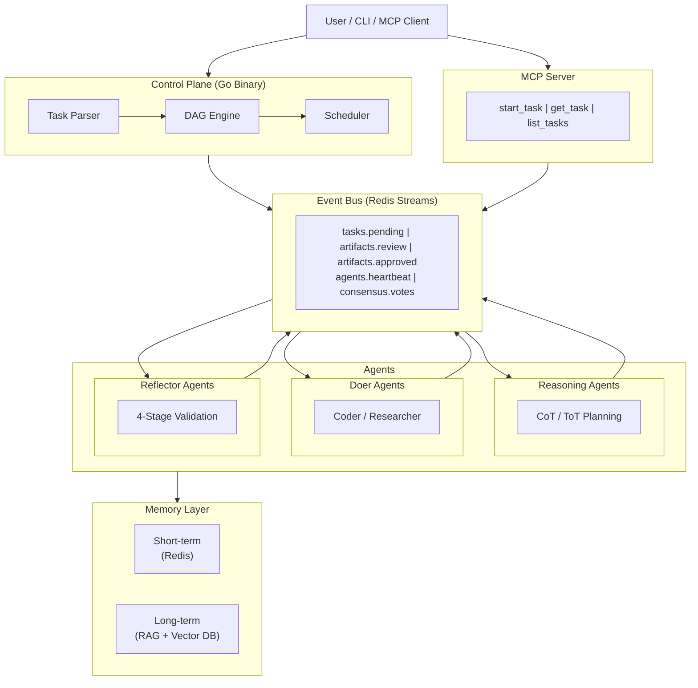

# CAOF -- Collective Agentic Orchestration Framework

> A multi-agent framework where agents are persistent service nodes, not linear chain steps.

<!-- Badges -->


---

## Overview

CAOF is a Controller/Worker multi-agent system that treats agents as **specialized, persistent service nodes** rather than steps in a linear prompt chain. Each agent operates independently and communicates through a Redis Streams event bus. The control plane is a single Go binary; agent logic runs in Python with full ML/AI ecosystem access.

---

## Installation

### From GitHub Releases (recommended)

Download the latest release zip for your platform from [Releases](https://github.com/danielckv/agentic-orchestration/releases):

| Platform | Archive |
|----------|---------|
| Linux x86_64 | `caof-linux-amd64.zip` |
| Linux ARM64 | `caof-linux-arm64.zip` |
| macOS Intel | `caof-darwin-amd64.zip` |
| macOS Apple Silicon | `caof-darwin-arm64.zip` |

```bash
# Download and extract
unzip caof-linux-amd64.zip -d caof
cd caof

# Run the setup script (installs binary, MCP server, systemd service)
sudo ./scripts/setup.sh

# Edit your API keys
sudo nano /etc/caof/mcp.env

# Start the MCP service
sudo systemctl enable --now caof-mcp
```

The setup script:
- Detects your platform and installs the correct binary to `/opt/caof/bin/caof`
- Symlinks to `/usr/local/bin/caof`
- Sets up the MCP server Python venv
- Installs a systemd service unit
- Creates `/etc/caof/mcp.env` for your API keys

### Build from source

**Prerequisites:** Go 1.22+, Python 3.11+, Make

```bash
git clone https://github.com/danielckv/agentic-orchestration.git
cd agentic-orchestration

make build            # Build for current platform
make build-all        # Cross-compile all 4 targets
make install          # Copy binary to $GOPATH/bin
```

---

## Quick Start

```bash
# Verify installation
caof version

# Bootstrap a workspace (requires Redis 7+ running)
caof init --workspace ~/caof-workspace

# Spawn agents
caof spawn --role=coder --session=coder-01
caof spawn --role=reviewer --session=reviewer-01

# Submit a goal
caof run --goal "Implement a binary search in Python"

# Monitor progress
caof status --dag
```

---

## MCP Integration

CAOF includes an MCP (Model Context Protocol) server that lets you start tasks from any MCP client -- for example, a WhatsApp bot via ClawdBot.

### Task types

| Type | What it does |
|------|-------------|
| **research** | Web research with file output. Fetches URLs, runs searches, produces a Markdown report. |
| **social_content** | Researches trending news on a topic, generates Twitter/LinkedIn posts. |
| **generic** | Any freeform task description. |

### How it works

1. You send a task description via your MCP client (WhatsApp, CLI, etc.)
2. The MCP server creates `~/caof-tasks/<task-id>/` with all output files
3. It researches the web, calls the configured LLM, and saves results
4. You retrieve the results via `get_task` or `get_task_file`

### MCP tools

| Tool | Description |
|------|-------------|
| `start_task` | Create and execute a new task. Params: `description`, `task_type`, `platform`, `topic`, `web_urls`, `search_queries` |
| `get_task` | Get status and results of a task by ID |
| `list_tasks` | List all tasks, optionally filtered by status |
| `get_task_file` | Read a specific file from a task's output folder |

### Running the MCP server

```bash
# Via Make (sets up venv automatically)
make mcp-run

# Or directly
cd mcp && python -m server

# As a systemd service (Linux)
make mcp-install
systemctl --user enable --now caof-mcp
```

### Configuration

The MCP server reads inference settings from `config/defaults.yaml` and provider configs from `config/providers/`. Override via environment variables:

```bash
export CAOF_INFERENCE_PROVIDER=anthropic
export CAOF_INFERENCE_MODEL=claude-sonnet-4-6
export CAOF_INFERENCE_API_KEY=sk-ant-...
```

Or edit `/etc/caof/mcp.env` (system install) or `~/.config/caof/mcp.env` (user install).

---

## Architecture



---

## CLI Reference

| Command | Description | Key Flags |
|---------|-------------|-----------|
| `caof version` | Print version, commit, and build date | |
| `caof init` | Bootstrap workspace, Redis, tmux sessions | `--workspace <path>` |
| `caof spawn` | Launch an agent in a tmux session | `--role=<role>` `--model=<model>` `--session=<name>` |
| `caof run` | Submit a goal for decomposition and execution | `--goal "<text>"` |
| `caof status` | Inspect DAG state and task progress | `--dag` `--verbose` |
| `caof resume` | Unblock a human-in-the-loop escalated task | `--task <task-id>` |
| `caof teardown` | Kill all sessions and clean up worktrees | `--force` |

**Agent roles:** `researcher`, `coder`, `reviewer`, `planner`

---

## Make Targets

```
build               Build Go CLI binary for current platform
build-all           Cross-compile for linux and macOS (amd64 + arm64)
install             Build and install binary to $GOPATH/bin
test                Run all tests (Go + Python)
lint                Run all linters
dev-setup           Set up local dev environment
mcp-setup           Set up MCP server Python venv
mcp-run             Run MCP server locally (stdio)
mcp-install         Install MCP as systemd user service
init                Bootstrap the full environment
run                 Submit a goal: make run GOAL="..."
clean               Remove build artifacts
help                Show all targets
```

---

## Systemd Service

The MCP server can run as a systemd service for always-on task execution.

**System-wide** (via `setup.sh` in release archive):
```bash
sudo ./scripts/setup.sh
sudo systemctl enable --now caof-mcp
sudo journalctl -u caof-mcp -f
```

**Per-user** (from source):
```bash
make mcp-install
systemctl --user enable --now caof-mcp
journalctl --user -u caof-mcp -f
```

---

## Configuration

CAOF loads `config/defaults.yaml` at startup. The Go binary embeds it at compile time.

Provider-specific configs:
```
config/providers/
├── llama.yaml       # Local llama.cpp endpoint
├── anthropic.yaml   # Anthropic Messages API
└── openai.yaml      # OpenAI Chat Completions API
```

Switch providers with `--model` flag or by changing `inference.provider` in config.

---

## License

MIT
