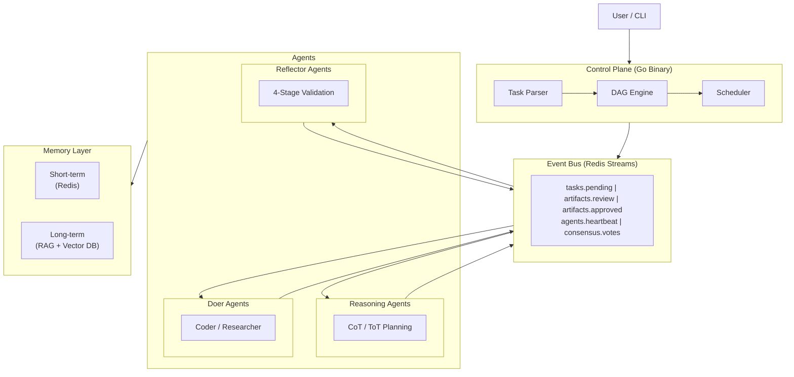
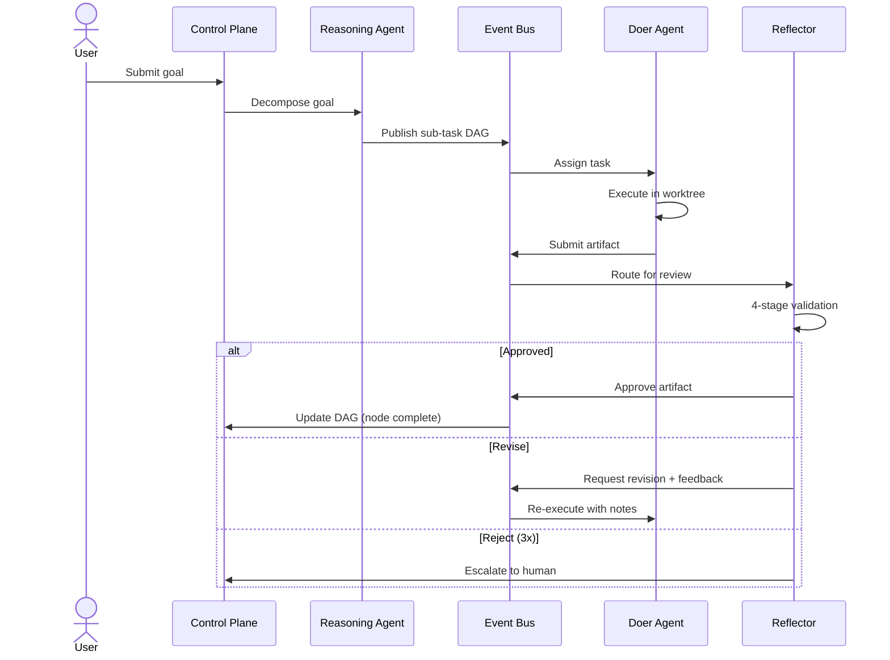

# CAOF -- Collective Agentic Orchestration Framework

> A multi-agent framework where agents are persistent service nodes, not linear chain steps.

<!-- Badges -->


---

## Overview

CAOF is a Controller/Worker multi-agent system that treats agents as **specialized, persistent service nodes** rather than steps in a linear prompt chain. Each agent operates independently, manages its own state, and communicates with other agents through a Redis Streams event bus. The result is a self-correcting R&D workflow engine that can decompose high-level goals into sub-tasks, execute them in parallel, and validate every output before it ships.

The control plane is a single Go binary that handles task parsing, DAG construction, scheduling, and agent lifecycle management. Agent logic runs in Python, giving you access to the full ML/AI ecosystem for reasoning, code generation, research synthesis, and artifact validation. Agents persist across disconnections via tmux sessions, and parallel coding tasks execute in isolated git worktrees.

CAOF is designed for **local-first execution**, **inference-provider portability** (swap between Llama, Anthropic, and OpenAI without code changes), and **human-in-the-loop oversight** for when agents get stuck or critical decisions need human judgment.

---

## Architecture



---

## Key Features

- **Modular agent architecture** -- each agent is a self-contained service with a single responsibility and its own tmux session.
- **DAG-based task orchestration** -- goals decompose into dependency graphs with parallel execution of independent sub-tasks.
- **Inference provider portability** -- swap between Llama (local), Anthropic, and OpenAI via configuration. No code changes required.
- **4-stage validation pipeline** -- every artifact passes schema validation, RAG cross-reference, automated testing, and LLM audit before approval.
- **Human-in-the-loop escalation** -- three consecutive rejections pause the DAG branch and notify the operator for manual intervention.
- **Consensus voting** -- critical decisions (architecture changes, strategy pivots) go through a panel-of-experts majority vote.
- **Research export** -- export research artifacts to Excel, CSV, JSON, or Markdown.
- **Process persistence and task isolation** -- tmux sessions survive disconnection; git worktrees sandbox parallel coding tasks.
- **Prometheus metrics and structured logging** -- task counters, agent load, latency histograms, and JSON logs with correlation IDs.
- **Auto-healing** -- agent respawn on crash, Redis reconnection with local buffering, inference retry with exponential backoff and provider fallback.

---

## Task Lifecycle



---

## Quick Start

**Prerequisites:** Go 1.22+, Python 3.11+, Redis 7+, tmux 3.3+, Git 2.40+, Make

```bash
# Clone the repository
git clone https://github.com/danielckv/agentic-orchestration.git
cd agentic-orchestration

# Build the Go CLI
make build

# Set up Python environment (option A: uv -- recommended)
cd agents && uv venv && uv pip install -e ".[dev]" && cd ..

# Set up Python environment (option B: classic venv)
cd agents && python3 -m venv .venv && source .venv/bin/activate && pip install -e ".[dev]" && cd ..

# Bootstrap the workspace
./bin/caof init --workspace ~/caof-workspace

# Spawn agents
./bin/caof spawn --role=coder --session=coder-01
./bin/caof spawn --role=reviewer --session=reviewer-01

# Submit a goal
./bin/caof run --goal "Implement a binary search in Python"

# Monitor progress
./bin/caof status --dag
```

---

## CLI Reference

| Command | Description | Key Flags |
|---------|-------------|-----------|
| `caof init` | Bootstrap workspace, Redis, tmux sessions, and registry | `--workspace <path>` |
| `caof spawn` | Launch an agent in a tmux session with a given role | `--role=<role>` `--model=<model>` `--session=<name>` |
| `caof run` | Submit a high-level goal for decomposition and execution | `--goal "<text>"` |
| `caof status` | List agents, inspect DAG state, and view task progress | `--dag` `--verbose` |
| `caof resume` | Unblock a task that was escalated to human-in-the-loop | `--task <task-id>` |
| `caof teardown` | Kill all tmux sessions and clean up worktrees | `--force` |

**Agent roles:** `researcher`, `coder`, `reviewer`, `planner`

---

## Project Structure

```
caof/
├── cmd/caof/                # Go CLI entrypoint and subcommands
│   ├── main.go              #   Cobra root command, config loading
│   ├── init.go              #   Bootstrap workspace
│   ├── spawn.go             #   Agent lifecycle management
│   ├── run.go               #   Goal submission and DAG construction
│   ├── status.go            #   Introspection and monitoring
│   ├── resume.go            #   HITL task resumption
│   └── teardown.go          #   Session cleanup
├── internal/
│   ├── dispatcher/          # Scheduler, DAG, registry, consensus, HITL,
│   │                        #   tmux, worktree, metrics, logging, health
│   ├── eventbus/            # Redis Streams abstraction + resilience layer
│   ├── memory/              # Short-term (Redis) + long-term (RAG) clients
│   ├── nativecore/          # Inference provider adapters (Llama/Anthropic/OpenAI)
│   └── config/              # Feature flags, embedded defaults
├── agents/                  # Python agent runtime
│   ├── shared/              #   Base agent, schemas, config, inference client, export
│   ├── reasoning/           #   CoT/ToT planner agents
│   ├── doers/               #   Coder, researcher, and tool-augmented agents
│   ├── reflectors/          #   4-stage validation agents
│   └── tests/               #   Python test suite
├── config/
│   ├── defaults.yaml        # Default settings (Redis, heartbeat, inference, streams)
│   └── providers/           # Per-provider configs (llama, anthropic, openai)
├── templates/               # Embedded prompt templates
├── drivers/cpp/             # Performance-critical data processors (planned)
├── scripts/                 # Bootstrap and utility scripts
├── specs/                   # System design and project context docs
├── api/                     # API definitions
├── Makefile                 # Build, test, lint, init, run, clean targets
├── go.mod / go.sum          # Go module dependencies
└── README.md
```

---

## Tech Stack

| Layer | Technology |
|-------|-----------|
| Orchestration CLI | Go 1.22+ (Cobra CLI, `go:embed` for templates) |
| Event Bus | Redis 7+ (Streams, Pub/Sub, Key-Value) |
| Agent Runtime | Python 3.11+ (agent logic, inference calls) |
| Inference Providers | Llama (local), Anthropic API, OpenAI API |
| Data Validation | Pydantic v2 |
| Vector Database | Provider-agnostic (Qdrant, Milvus, or FAISS) |
| Web Scraping | httpx (basic); Scrapy-Cluster (planned) |
| Process Management | tmux 3.3+ (session persistence) |
| Task Isolation | Git 2.40+ worktrees |
| Build System | GNU Make |
| Metrics | Prometheus-compatible counters and histograms |
| Low-level Drivers | C++ (planned, for performance-critical processing) |

---

## Agent Roles

| Role | Capabilities | Example Tasks |
|------|-------------|---------------|
| **Planner** | CoT/ToT reasoning, DAG modification, goal decomposition | Break down "build a REST API" into sub-tasks with dependencies |
| **Coder** | File I/O, code execution sandbox, git operations | Generate Python modules, write tests, apply patches in worktrees |
| **Researcher** | Web search, RAG retrieval, citation management | Synthesize findings from papers, export research to Excel/CSV |
| **Reviewer** | 4-stage validation, diff auditing, consensus voting | Validate code artifacts, flag contradictions, approve or reject |

---

## Testing

```bash
# Run Go tests
go test ./... -v

# Run Python tests
cd agents && python3 -m pytest tests/ -v

# Run all tests via Make
make test

# Lint all code
make lint
```

---

## Configuration

CAOF loads configuration from `config/defaults.yaml` at startup. The Go binary embeds this file at compile time via `go:embed`, so the binary works without external config files.

Key configuration areas:

- **Redis** -- host, port, and stream names
- **Heartbeat** -- interval and timeout thresholds for agent health monitoring
- **Inference** -- default provider, model, endpoint, and retry settings
- **Streams** -- Redis Stream names for tasks, artifacts, heartbeats, and consensus

Provider-specific settings live in `config/providers/`:

```
config/providers/
├── llama.yaml       # Local llama.cpp endpoint
├── anthropic.yaml   # Anthropic Messages API
└── openai.yaml      # OpenAI Chat Completions API
```

Switch providers at spawn time with the `--model` flag or by changing `inference.provider` in your config.

---

## Documentation

The full documentation site is built with MkDocs. To run it locally:

```bash
mkdocs serve
```

For the system design specification, see `specs/SYSTEM_CORE.md`. For a snapshot of the current implementation status, see `specs/PROJECT_CONTEXT.md`.

---

## Contributing

Contributions are welcome. Please open an issue to discuss significant changes before submitting a pull request.

1. Fork the repository.
2. Create a feature branch from `main`.
3. Write tests for new functionality.
4. Run `make test` and `make lint` before submitting.
5. Open a pull request with a clear description of the change.

---

## License

MIT
