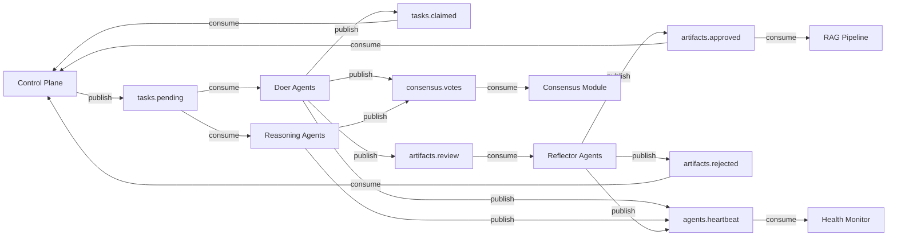

# Event Bus

All inter-agent communication in CAOF flows through **Redis Streams**, providing ordered, persistent, fan-out messaging. The event bus decouples producers from consumers and guarantees that no messages are lost, even if an agent crashes and restarts.

## Stream Topology

CAOF uses 7 dedicated streams, each serving a specific purpose in the task lifecycle:

| Stream | Publisher | Consumer(s) | Purpose |
|--------|-----------|-------------|---------|
| `tasks.pending` | Control Plane | Doer agents, Reasoning agents | Decomposed sub-tasks ready for execution |
| `tasks.claimed` | Worker agents | Control Plane | Workers announce task acquisition |
| `artifacts.review` | Doer agents | Reflector agents | Artifacts submitted for validation |
| `artifacts.approved` | Reflector agents | Control Plane, RAG pipeline | Approved artifacts ready for commit |
| `artifacts.rejected` | Reflector agents | Control Plane | Rejections that trigger escalation |
| `agents.heartbeat` | All agents | Health monitor | Periodic health pings |
| `consensus.votes` | Voting agents | Consensus module | Votes for critical decisions |



## Message Schemas

### TaskMessage

Published to `tasks.pending` when the Control Plane decomposes a goal.

```json
{
  "task_id": "uuid-v4",
  "parent_task_id": "uuid-v4 | null",
  "dag_position": {
    "depth": 2,
    "index": 1
  },
  "role_required": "coder",
  "priority": "high",
  "spec": {
    "description": "Implement attention head pruning in transformer block",
    "constraints": ["Python 3.11+", "no external deps beyond torch"],
    "acceptance_criteria": ["unit tests pass", "benchmarks within 5% of baseline"]
  },
  "context_refs": [
    "rag://papers/attention-pruning-2024",
    "memory://decision-log/arch-v2"
  ],
  "created_at": "2026-04-13T10:00:00Z",
  "ttl_seconds": 3600
}
```

### ArtifactMessage

Published to `artifacts.review` by Doer agents after task execution.

```json
{
  "artifact_id": "uuid-v4",
  "task_id": "uuid-v4",
  "agent_id": "coder-01",
  "content": "... artifact content (code patch, research summary, etc.) ...",
  "content_type": "code_patch",
  "confidence": 0.87,
  "metadata": {
    "language": "python",
    "files_changed": ["src/attention.py"],
    "test_results": "14 passed, 0 failed"
  },
  "timestamp": "2026-04-13T10:05:00Z"
}
```

### HeartbeatMessage

Published to `agents.heartbeat` by all agents on a configurable interval (default: 30 seconds).

```json
{
  "agent_id": "coder-01",
  "role": "coder",
  "status": "idle",
  "current_task_id": null,
  "load": 0,
  "max_load": 2,
  "timestamp": "2026-04-13T10:00:30Z"
}
```

### VoteMessage

Published to `consensus.votes` during critical decision points.

```json
{
  "decision_id": "uuid-v4",
  "voter_agent_id": "researcher-01",
  "option_selected": "option_1",
  "confidence": 0.82,
  "rationale": "Based on RAG retrieval of prior experiments...",
  "references": ["rag://experiments/attn-pruning-run-7"]
}
```

## Consumer Group Design

Each stream uses Redis consumer groups to distribute messages across agent instances of the same type:

- **Group per role**: All coder agents share a consumer group on `tasks.pending`, so each task is delivered to exactly one coder.
- **Acknowledgment**: Agents call `XACK` after processing a message. Unacknowledged messages are re-delivered on timeout.
- **Pending Entry List (PEL)**: Redis tracks which messages have been delivered but not acknowledged, enabling recovery after crashes.

```bash
# Consumer group creation (handled automatically by CAOF)
XGROUP CREATE tasks.pending doers $ MKSTREAM
XGROUP CREATE tasks.pending reasoners $ MKSTREAM
XGROUP CREATE artifacts.review reflectors $ MKSTREAM
```

## Resilience

The event bus includes several resilience mechanisms:

!!! info "Local buffering"
    If Redis becomes temporarily unavailable, agents buffer messages in a bounded in-memory queue. Once the connection is restored, buffered messages are published in order.

!!! info "Reconnection with backoff"
    The `ResilientEventBus` wrapper automatically reconnects to Redis using exponential backoff. Agents do not need to handle connection failures manually.

!!! info "Stream replay"
    Because Redis Streams are append-only, the system can rebuild state by replaying messages from a specific offset. This is used for crash recovery and state reconstruction after Redis restarts.

### Failure Handling

| Scenario | Detection | Recovery |
|----------|-----------|----------|
| Agent crash mid-task | Missing heartbeat (>90s) | Task returns to pending pool; Control Plane respawns agent |
| Redis unavailable | Connection error | Local buffering + exponential backoff reconnection |
| Message processing failure | Agent exception | Message stays in PEL; re-delivered after visibility timeout |
| Slow consumer | Growing PEL length | Health monitor alerts; potential auto-scaling (future) |
