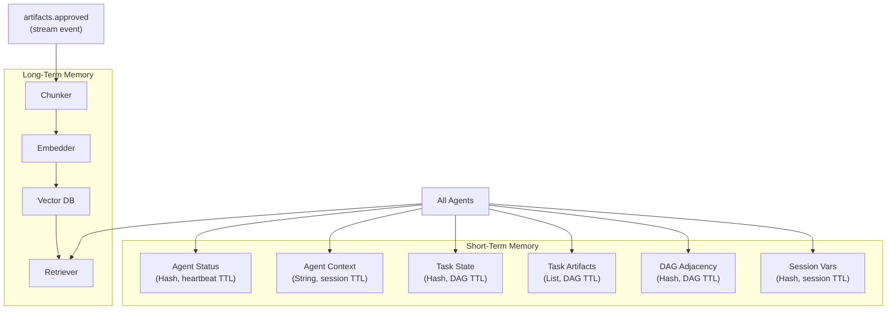
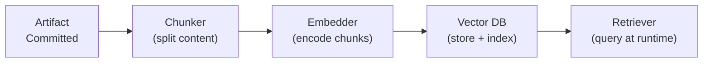

# Memory System

CAOF uses a **dual-layer memory architecture** that separates fast operational state (short-term) from persistent knowledge (long-term). Every agent has access to both layers through a unified interface.

## Architecture



## Short-Term Memory (Redis)

Short-term memory stores operational state that agents need during active task execution. All data lives in Redis with appropriate TTLs.

### Key Patterns

| Key Pattern | Value Type | TTL | Purpose |
|------------|-----------|-----|---------|
| `agent:{id}:status` | Hash | Heartbeat-driven | Agent role, status, current load |
| `agent:{id}:context` | String | Session-scoped | Current task context window |
| `task:{id}:state` | Hash | Until DAG completes | Task status, assignment, attempts |
| `task:{id}:artifacts` | List | Until DAG completes | Artifact IDs produced for this task |
| `dag:{id}:adjacency` | Hash | Until DAG completes | DAG edge list for dependency resolution |
| `session:{id}:vars` | Hash | Session-scoped | Arbitrary key-value pairs for agent sessions |

### TTL Strategy

- **Heartbeat-driven**: Agent status keys expire if no heartbeat is received within `stale_threshold_seconds` (default: 90s). This automatically cleans up dead agents.
- **Session-scoped**: Context and session variables persist for the lifetime of the tmux session. They are cleaned up on `caof teardown`.
- **DAG-scoped**: Task state and DAG adjacency persist until the entire DAG completes or is cancelled.

### Usage Example

```python
# From an agent's perspective (Python)
import redis

r = redis.Redis(host='localhost', port=6379, db=0)

# Read current task state
state = r.hgetall("task:abc123:state")

# Update agent status
r.hset("agent:coder-01:status", mapping={
    "role": "coder",
    "status": "busy",
    "current_task": "abc123",
    "load": "1"
})
r.expire("agent:coder-01:status", 90)
```

## Long-Term Memory (RAG Pipeline)

Long-term memory stores knowledge that persists across sessions and can be queried by any agent at any time. It is backed by a RAG (Retrieval-Augmented Generation) pipeline.

### Pipeline Stages

The RAG pipeline triggers automatically on every `artifacts.approved` event:



1. **Chunker** -- Splits artifact content into semantically meaningful chunks (code functions, paragraphs, data sections).
2. **Embedder** -- Encodes each chunk into a dense vector using the configured embedding model.
3. **Vector DB** -- Stores vectors with metadata for efficient similarity search. Provider-agnostic (Qdrant, Milvus, or FAISS).
4. **Retriever** -- Accepts natural-language queries and returns the most relevant chunks ranked by similarity score.

### What Gets Stored

| Content Type | Source | Use Case |
|-------------|--------|----------|
| Decision logs | Consensus rounds | Understanding past architectural choices |
| Code artifacts | Coder doers | Finding reusable functions and patterns |
| Research summaries | Researcher doers | Cross-referencing findings |
| Reflection verdicts | Reflector agents | Learning from past approval/rejection rationale |
| Experiment results | All agents | Comparing benchmarks and outcomes |

### Query Interface

The retrieval interface is defined in Go and used by agents via the shared memory client:

```go
type MemoryQuery struct {
    Text       string   // Natural language query
    Filters    []Filter // e.g., type=code, created_after=2026-01-01
    TopK       int      // Number of results to return
    MinScore   float64  // Minimum similarity threshold
}

type MemoryResult struct {
    ChunkID    string
    Content    string
    Score      float64
    Source     string              // Artifact ID or document reference
    Metadata   map[string]string
}
```

### Long-Term Memory Interface

```go
type LongTermMemory interface {
    Store(ctx context.Context, id, content, source string, metadata map[string]string) error
    Query(ctx context.Context, q MemoryQuery) ([]MemoryResult, error)
    Delete(ctx context.Context, id string) error
    Close() error
}
```

!!! note "Current implementation"
    Phase 1-4 uses an in-memory keyword-matching implementation (`InMemoryLTM`) as a placeholder. Integration with FAISS or Qdrant for production-grade vector search is planned for a future release.

## Context Flow

When an agent receives a task, it builds its context window by combining short-term and long-term memory:

1. **Task spec** -- Loaded from `task:{id}:state` (short-term).
2. **Context references** -- The task's `context_refs` field points to specific long-term memory entries (e.g., `rag://papers/attention-pruning-2024`).
3. **Relevant history** -- The agent queries long-term memory with the task description to find related past artifacts.
4. **Session state** -- Any accumulated context from the current session (short-term).

This assembled context is passed to the inference provider along with the agent's role-specific prompt template.
