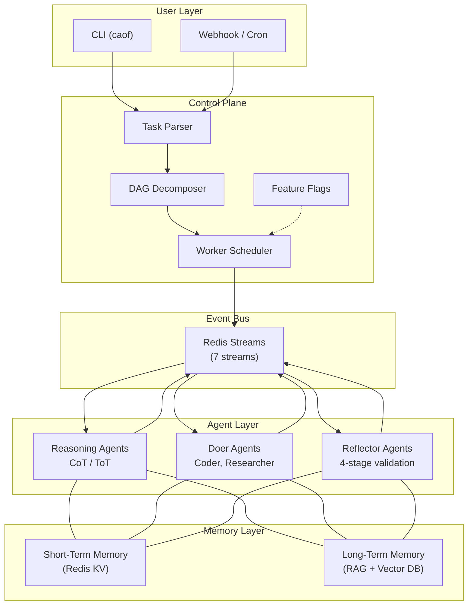
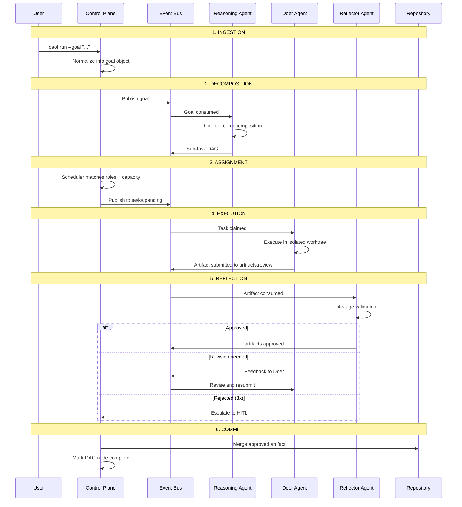

# Architecture Overview

CAOF follows a **Controller/Worker** pattern where a single Go binary (the Control Plane) orchestrates a pool of specialized Python agents that communicate through Redis Streams.

## System Layers

The architecture is organized into five layers:



### 1. Control Plane (Dispatcher)

The single orchestration authority. A statically compiled Go binary with zero external runtime dependencies.

**Responsibilities:**

- Parse high-level goals into a DAG of sub-tasks.
- Assign tasks to worker agents based on role flags and current load.
- Manage the lifecycle of tmux sessions and git worktrees.
- Expose an internal HTTP registry for agent discovery.

See [Control Plane](../components/control-plane.md) for full details.

### 2. Event Bus (Redis Streams)

All inter-agent communication flows through Redis Streams, providing ordered, persistent, fan-out messaging across 7 dedicated streams.

See [Event Bus](event-bus.md) for stream topology and message schemas.

### 3. Agent Layer

Three categories of agents, each running as a long-lived process inside a tmux pane:

| Category | Role | Purpose |
|----------|------|---------|
| **Reasoning** | Planner | Decomposes goals into sub-task DAGs using CoT or ToT strategies |
| **Doers** | Coder, Researcher | Executes tasks in isolated environments, produces artifacts |
| **Reflectors** | Reviewer | Validates artifacts through a 4-stage pipeline |

See [Agent System](../components/agents.md) for agent lifecycle and capabilities.

### 4. Memory Layer

A dual-layer system combining fast operational state with persistent knowledge:

- **Short-term (Redis)**: Agent status, task state, DAG adjacency, session variables.
- **Long-term (RAG)**: Embeddings of past decisions, code, research, and experiments.

See [Memory System](memory.md) for the full data model.

### 5. Process Isolation

Each agent runs in its own tmux session. Code execution happens in dedicated git worktrees, preventing parallel tasks from interfering with each other.

```
tmux session: caof-main
  pane 0: Control Plane (dispatcher process)
  pane 1: Event Bus monitor (redis-cli XREAD)

tmux session: caof-coder-01
  pane 0: Doer agent process
  pane 1: Worktree: ~/workspace/.worktrees/task-abc123/

tmux session: caof-reviewer-01
  pane 0: Reflector agent process
  pane 1: Diff viewer (current artifact under review)
```

## Task Lifecycle

Every goal follows this six-stage lifecycle:



### Stage Details

1. **Ingestion** -- The CLI receives a natural-language goal. The Control Plane normalizes it into a structured goal object.
2. **Decomposition** -- A Reasoning Agent produces a DAG where each node is a sub-task with role requirements, dependencies, and acceptance criteria.
3. **Assignment** -- The Scheduler publishes sub-tasks to `tasks.pending`. Workers with matching roles and available capacity claim tasks via `tasks.claimed`.
4. **Execution** -- The Doer agent executes inside its isolated environment and produces an artifact submitted to `artifacts.review`.
5. **Reflection** -- A Reflector runs a 4-stage audit. Revisions loop back to step 4. Three consecutive rejections escalate to human-in-the-loop.
6. **Commit** -- Approved artifacts are committed to the shared repository. The DAG node is marked complete, potentially unblocking downstream tasks.

## Design Principles

| Principle | Description |
|-----------|-------------|
| **Modularity** | Each agent is a self-contained service with a single responsibility. |
| **Persistence** | Agent processes survive disconnection via tmux session management. |
| **Isolation** | Parallel coding tasks execute in separate git worktree sandboxes. |
| **Auditability** | Every Doer output passes through a Reflector before commit. |
| **Portability** | Inference backend is swappable -- local (Llama) or remote (API). |

## Directory Structure

```
caof/
├── cmd/caof/              # CLI entrypoint and subcommands
├── internal/
│   ├── dispatcher/        # Scheduler, DAG engine, registry
│   ├── eventbus/          # Redis Streams abstraction
│   ├── memory/            # Short-term + long-term memory
│   ├── nativecore/        # Inference provider adapters
│   └── config/            # Feature flags, embedded defaults
├── agents/
│   ├── reasoning/         # CoT/ToT planner agents (Python)
│   ├── doers/             # Execution agents (Python)
│   ├── reflectors/        # Validation agents (Python)
│   └── shared/            # Common utilities, base classes
├── config/
│   ├── defaults.yaml      # Default configuration
│   └── providers/         # Per-provider inference configs
├── templates/             # Embedded prompt templates
├── scripts/               # Bootstrap and utility scripts
└── Makefile
```
