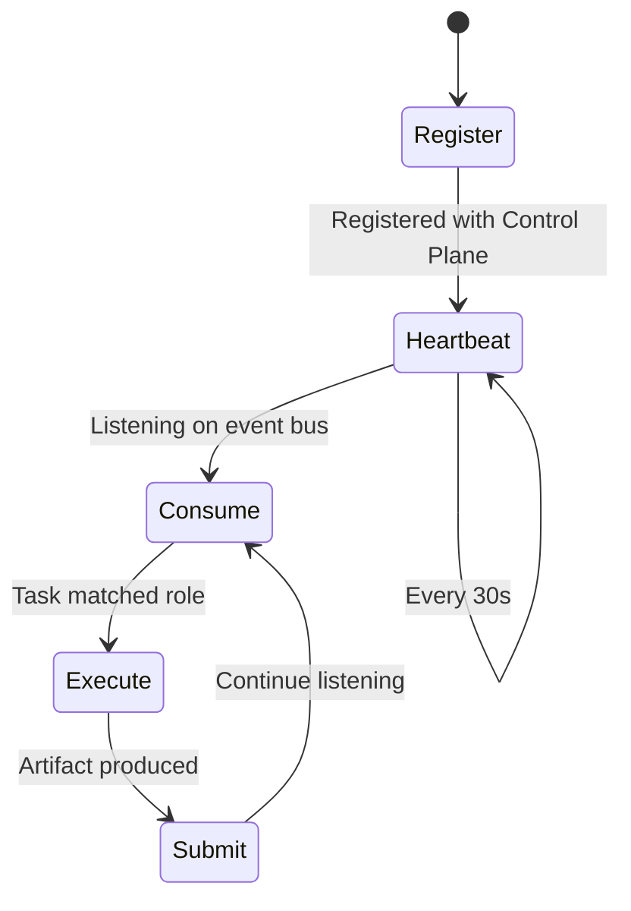
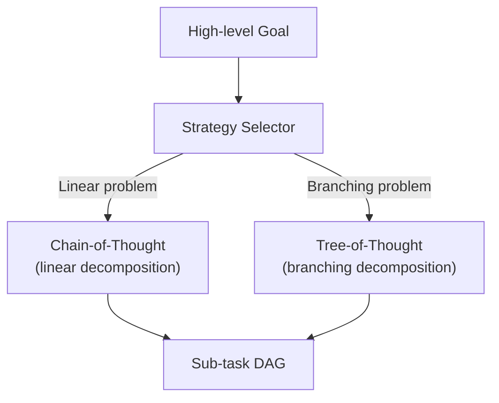
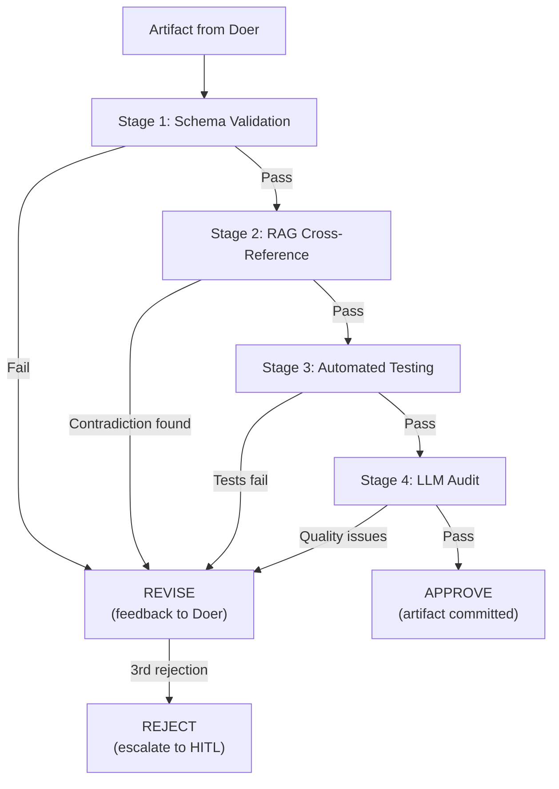

# Agent System

Agents are the execution units of CAOF. Each agent is a long-lived Python process running inside a tmux pane, subscribing to the event bus for task assignments, and communicating results back through Redis Streams.

## BaseAgent Lifecycle

All agents extend the `BaseAgent` abstract class, which provides the core lifecycle loop:



### Lifecycle Stages

1. **Register** -- The agent calls the Control Plane's HTTP registry to announce its ID, role, capabilities, model, and capacity.
2. **Heartbeat** -- A background thread sends periodic health pings to `agents.heartbeat` (default: every 30 seconds).
3. **Consume** -- The agent subscribes to `tasks.pending` via a consumer group filtered by role. It blocks until a matching task arrives.
4. **Execute** -- The agent calls its `on_task()` implementation to process the task. This is where role-specific logic runs.
5. **Submit** -- The agent publishes the resulting artifact to `artifacts.review` with metadata and a confidence score.

### Python Interface

```python
class BaseAgent(ABC):
    """Abstract base class for all CAOF agents."""

    @abstractmethod
    def on_task(self, task: TaskMessage) -> None:
        """Process a task. Must be implemented by subclasses."""
        ...

    def start(self) -> None:
        """Main loop: register, heartbeat, consume, execute."""
        ...

    def claim_task(self, task_id: str) -> None:
        """Announce task acquisition on tasks.claimed."""
        ...

    def submit_artifact(
        self, task_id: str, content: str, confidence: float
    ) -> str:
        """Publish artifact to artifacts.review. Returns artifact ID."""
        ...
```

## Agent Types

### Reasoning Agents

Reasoning agents decompose high-level goals into sub-task DAGs. They do not execute tasks themselves.

#### Strategy Selection

The strategy selector chooses between two decomposition approaches based on problem characteristics:

| Strategy | When Used | Output |
|----------|----------|--------|
| **Chain-of-Thought (CoT)** | Straightforward goals with a clear linear path | Linear sequence of sub-tasks |
| **Tree-of-Thought (ToT)** | Complex goals where multiple viable approaches exist | Branching DAG with parallel paths |



**Source files:**

- `agents/reasoning/base_reasoner.py` -- ReasoningAgent base class
- `agents/reasoning/cot.py` -- Chain-of-Thought implementation
- `agents/reasoning/tot.py` -- Tree-of-Thought implementation
- `agents/reasoning/strategy_selector.py` -- CoT/ToT selection heuristic

### Doer Agents

Doer agents execute tasks and produce artifacts. Each doer is scoped to a specific capability set determined by its role.

#### Coder Doer

Generates code using LLM inference and writes it to an isolated git worktree.

- **Capabilities**: File I/O, code execution sandbox, git operations
- **Isolation**: Each task gets a dedicated `git worktree` at `~/workspace/.worktrees/task-{id}/`
- **Output**: Code patches with test results

#### Researcher Doer

Synthesizes research using LLM inference and web retrieval.

- **Capabilities**: Web search, RAG retrieval, citation tools
- **Output**: Research summaries with source references and confidence scores

#### Research Export Doer

Converts research artifacts into structured output formats.

- **Capabilities**: Export to Excel, CSV, JSON, Markdown
- **Output**: Formatted files ready for downstream consumption

See [Research & Export](research-export.md) for details.

#### Echo Doer

A minimal agent used for integration testing. Echoes back the task spec as its artifact.

**Source files:**

- `agents/doers/base_doer.py` -- BaseDoer with role-filtered task execution
- `agents/doers/coder.py` -- CoderDoer
- `agents/doers/researcher.py` -- ResearcherDoer
- `agents/doers/research_export.py` -- ResearchExportDoer
- `agents/doers/echo_doer.py` -- Echo agent for testing
- `agents/doers/tools/file_io.py` -- Worktree-scoped file I/O
- `agents/doers/tools/code_exec.py` -- Sandboxed subprocess execution
- `agents/doers/tools/web_scrape.py` -- URL fetcher

### Reflector Agents

Reflector agents validate artifacts through a 4-stage pipeline. They never modify an artifact -- they only approve, request revision, or reject.

#### Validation Pipeline



| Stage | Module | Check |
|-------|--------|-------|
| 1. Schema validation | `schema_validator.py` | Does the artifact match the expected output format? |
| 2. RAG cross-reference | `rag_crossref.py` | Does it contradict known data in long-term memory? |
| 3. Automated testing | `test_runner.py` | Do unit tests pass? Does linting (ruff) pass? |
| 4. LLM audit | `llm_auditor.py` | Human-readable quality review by the inference model |

An additional `security_scan.py` module checks for leaked secrets and known vulnerability patterns.

**Verdicts:**

| Verdict | Action |
|---------|--------|
| **Approve** | Artifact is committed to the repository and the DAG node is marked complete |
| **Revise** | Artifact is sent back to the Doer with structured feedback notes |
| **Reject** | After 3 consecutive rejections, the task escalates to human-in-the-loop |

**Source files:**

- `agents/reflectors/base_reflector.py` -- ReflectorAgent with 4-stage pipeline
- `agents/reflectors/schema_validator.py` -- Stage 1
- `agents/reflectors/rag_crossref.py` -- Stage 2
- `agents/reflectors/test_runner.py` -- Stage 3
- `agents/reflectors/llm_auditor.py` -- Stage 4
- `agents/reflectors/security_scan.py` -- Secret/vulnerability scanning

## Agent Roles and Capabilities

| Role | Agent Type | Capabilities | Max Concurrent Tasks |
|------|-----------|-------------|---------------------|
| `planner` | Reasoning | CoT/ToT decomposition, DAG modification | 1 |
| `coder` | Doer | File I/O, code execution, git operations | 2 |
| `researcher` | Doer | Web search, RAG retrieval, citations | 2 |
| `reviewer` | Reflector | 4-stage validation, diff auditing, consensus voting | 3 |

## Configuration

Agent behavior is controlled through environment variables and YAML configuration:

```python
class AgentConfig:
    agent_id: str          # Unique identifier
    role: str              # planner, coder, researcher, reviewer
    redis_url: str         # Redis connection string
    registry_url: str      # Control Plane registry endpoint
    inference_provider: str # llama, anthropic, openai
    inference_model: str   # Model name
    heartbeat_interval: int # Seconds between heartbeats (default: 30)
```

See [Configuration Reference](../reference/configuration.md) for all options.
