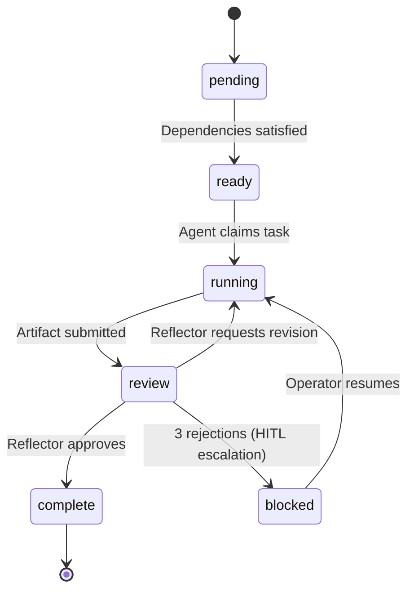

# Control Plane

The Control Plane is the single orchestration authority in CAOF. It is a statically compiled Go binary (the `caof` CLI) that coordinates all agent activity, manages the task DAG, and handles lifecycle operations.

## CLI Commands

| Command | Description | Example |
|---------|-------------|---------|
| `caof init` | Bootstrap the workspace, start Redis, create tmux sessions | `caof init --workspace ~/my-workspace` |
| `caof spawn` | Launch an agent in a tmux session with a given role | `caof spawn --role=coder --model=llama-local` |
| `caof run` | Submit a goal for decomposition and execution | `caof run --goal "Analyze transformer papers"` |
| `caof status` | Show agent status and DAG state | `caof status --dag --verbose` |
| `caof resume` | Unblock a task escalated to human-in-the-loop | `caof resume --task <task-id>` |
| `caof teardown` | Kill all tmux sessions and remove worktrees | `caof teardown --force` |

### init

Bootstraps the full environment:

1. Validates all system dependencies (Go, Python, Redis, Git, tmux, Make).
2. Starts a local Redis instance if not already running.
3. Creates the initial tmux session layout (Control Plane + monitor panes).
4. Initializes the Git repository and base worktree structure.
5. Loads embedded default configuration and prompt templates.

```bash
caof init --workspace ~/projects/caof-run
```

### spawn

Launches a new agent process inside a dedicated tmux session. The agent automatically registers with the Control Plane's HTTP registry.

```bash
caof spawn --role=coder --model=llama-local --session=coder-01
```

**Feature flags by role:**

| Flag | Effect |
|------|--------|
| `--role=researcher` | Enables web search, RAG retrieval, citation tools |
| `--role=coder` | Enables file I/O, code execution sandbox, git operations |
| `--role=reviewer` | Enables reflection loop, diff auditing, consensus voting |
| `--role=planner` | Enables CoT/ToT reasoning, DAG modification privileges |

### run

Submits a natural-language goal. The Control Plane normalizes it into a structured goal object, publishes it for decomposition, and then distributes the resulting sub-tasks.

```bash
caof run --goal "Write a sorting algorithm in Python with unit tests"
```

### status

Displays the current state of agents and the task DAG.

```bash
# Basic status
caof status

# With DAG visualization
caof status --dag

# Verbose output
caof status --dag --verbose
```

## Scheduler

The scheduler is responsible for matching sub-tasks to available agents.

### Assignment Logic

1. **Role matching** -- Only agents whose role matches `role_required` on the task are eligible.
2. **Capacity check** -- The scheduler filters for agents where `current_load < max_concurrent_tasks`.
3. **Load balancing** -- Among eligible agents, the one with the lowest current load is selected.
4. **Adaptive scheduling** -- Historical task duration data is used to estimate completion times and optimize assignment (Phase 4 feature).

### DAG Progression

The scheduler runs a continuous loop:

1. Check the DAG for nodes in the `ready` state (all dependencies satisfied).
2. For each ready node, find an eligible agent and publish the task to `tasks.pending`.
3. When a task is claimed (via `tasks.claimed`), update the node state to `running`.
4. When an artifact is approved (via `artifacts.approved`), mark the node as `complete` and re-evaluate downstream dependencies.
5. If all nodes are complete, the DAG is finished.

## DAG Engine

The DAG engine manages the directed acyclic graph that represents the decomposed goal.

### Node States



| State | Description |
|-------|-------------|
| `pending` | Task created but has unresolved dependencies |
| `ready` | All dependencies satisfied; waiting for agent assignment |
| `running` | An agent has claimed the task and is executing |
| `review` | Artifact submitted and under Reflector validation |
| `complete` | Artifact approved and committed |
| `blocked` | Escalated to human-in-the-loop after repeated rejections |

### Dependency Resolution

- The DAG is built during the decomposition phase by a Reasoning Agent.
- Each node declares its dependencies as edges to other nodes.
- The engine performs **topological sorting** to determine execution order.
- Nodes at the same depth level with no mutual dependencies can run in **parallel**.
- A **cycle detection** algorithm runs at decomposition time and again at runtime to prevent deadlocks.

### Deadlock Detection

The Phase 4 deadlock detector continuously monitors the DAG for:

- **Circular dependencies** introduced by runtime DAG modifications.
- **Resource deadlocks** where agents are waiting on each other's outputs.
- **Stale nodes** that have been in `running` state longer than the configured timeout.

When a deadlock is detected, the affected DAG branch is paused and escalated.

## Configuration

The Control Plane loads configuration from `config/defaults.yaml` at startup. The Go binary embeds this file at compile time using `go:embed`:

```go
//go:embed config/defaults.yaml
var defaultConfig []byte

//go:embed templates/*
var promptTemplates embed.FS
```

See [Configuration Reference](../reference/configuration.md) for the full defaults.yaml specification.

## Internal Architecture

```
cmd/caof/
  main.go          # Cobra root command, config loading
  init.go          # Bootstrap workspace
  spawn.go         # Agent lifecycle management
  run.go           # Goal submission and DAG construction
  status.go        # Introspection and monitoring
  resume.go        # HITL resume workflow
  teardown.go      # Cleanup

internal/dispatcher/
  scheduler.go     # Task-to-agent assignment
  dag.go           # DAG construction and traversal
  registry.go      # HTTP agent registry
  consensus.go     # Voting panel
  hitl.go          # Human-in-the-loop escalation
  tmux.go          # tmux session management
  worktree.go      # Git worktree lifecycle
  metrics.go       # Prometheus metrics
  logger.go        # Structured JSON logging
  health.go        # Agent health monitor
  deadlock.go      # Runtime cycle detection
  adaptive.go      # Adaptive scheduling
```
