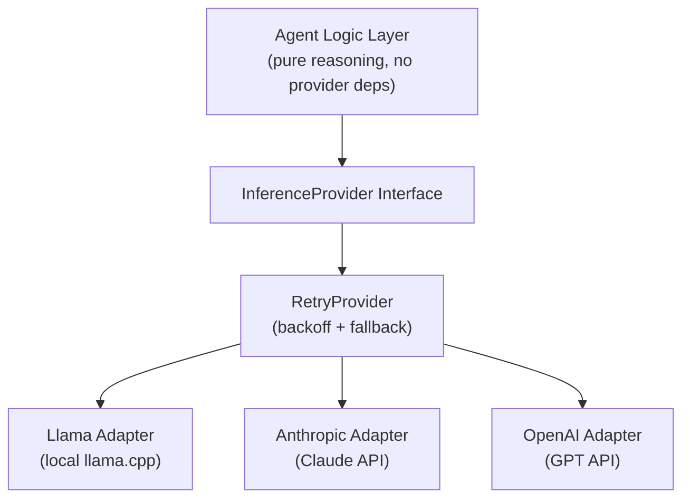

# Inference Providers

CAOF decouples agent logic from inference backends through the **NativeCore adapter layer**. You can swap between local and remote providers with a configuration change -- no code modifications required.

## Architecture



## InferenceProvider Interface

All providers implement the same Go interface:

```go
type InferenceProvider interface {
    // Complete sends a prompt and returns the full response.
    Complete(ctx context.Context, req CompletionRequest) (CompletionResponse, error)

    // StreamComplete sends a prompt and returns a channel of streaming chunks.
    StreamComplete(ctx context.Context, req CompletionRequest) (<-chan StreamChunk, error)

    // Embed encodes text into dense vectors for the RAG pipeline.
    Embed(ctx context.Context, texts []string) ([][]float64, error)

    // Name returns the provider identifier.
    Name() string
}
```

Python agents use a corresponding `InferenceClient` class:

```python
class InferenceClient:
    def complete(
        self,
        messages: list[dict],
        max_tokens: int = 4096,
        temperature: float = 0.7
    ) -> str:
        """Send a chat completion request and return the response text."""
        ...
```

## Supported Providers

### Llama (Local)

Connects to a local [llama.cpp](https://github.com/ggerganov/llama.cpp) server for fully offline inference.

**Configuration** (`config/providers/llama.yaml`):

```yaml
provider: "llama"
model: "llama-3.2-70b"
endpoint: "http://localhost:8080"
api_key_env: ""
```

!!! tip "Running Llama locally"
    Start a llama.cpp server before spawning agents:
    ```bash
    ./llama-server -m models/llama-3.2-70b.gguf --port 8080
    ```

### Anthropic

Connects to the [Anthropic Messages API](https://docs.anthropic.com/en/docs/build-with-claude/overview) for Claude models.

**Configuration** (`config/providers/anthropic.yaml`):

```yaml
provider: "anthropic"
model: "claude-sonnet-4-6"
endpoint: "https://api.anthropic.com"
api_key_env: "ANTHROPIC_API_KEY"
```

!!! warning "API key required"
    Set the `ANTHROPIC_API_KEY` environment variable before starting agents:
    ```bash
    export ANTHROPIC_API_KEY="sk-ant-..."
    ```

### OpenAI

Connects to the [OpenAI Chat Completions API](https://platform.openai.com/docs/api-reference/chat).

**Configuration** (`config/providers/openai.yaml`):

```yaml
provider: "openai"
model: "gpt-4o"
endpoint: "https://api.openai.com"
api_key_env: "OPENAI_API_KEY"
```

## Provider Selection

The active provider is set in `config/defaults.yaml`:

```yaml
inference:
  provider: "openai"     # llama, anthropic, or openai
  model: "gpt-4o"
  endpoint: ""           # Override endpoint (optional)
  timeout_seconds: 120
```

You can also override the provider per agent at spawn time:

```bash
caof spawn --role=coder --model=llama-local
```

## Retry and Fallback

The `RetryProvider` wrapper adds resilience to any provider:

### Exponential Backoff

When a request fails (network error, rate limit, timeout), the system retries with exponential backoff:

1. **Attempt 1**: Immediate
2. **Attempt 2**: Wait 1 second
3. **Attempt 3**: Wait 2 seconds
4. **Attempt 4**: Wait 4 seconds
5. **Attempt 5**: Wait 8 seconds

After exhausting retries, the error is propagated to the agent.

### Provider Fallback

If a primary provider is consistently failing, the system can fall back to a secondary provider:

```yaml
# Example: Use Anthropic as primary, OpenAI as fallback
inference:
  provider: "anthropic"
  model: "claude-sonnet-4-6"
  fallback:
    provider: "openai"
    model: "gpt-4o"
```

!!! info "Fallback is transparent"
    Agents do not need to handle provider switching. The RetryProvider automatically tries the fallback after the primary provider exhausts its retries.

## Source Files

| File | Purpose |
|------|---------|
| `internal/nativecore/provider.go` | InferenceProvider interface and factory |
| `internal/nativecore/llama.go` | Local llama.cpp adapter |
| `internal/nativecore/anthropic.go` | Anthropic Messages API adapter |
| `internal/nativecore/openai.go` | OpenAI Chat Completions adapter |
| `internal/nativecore/retry.go` | RetryProvider with exponential backoff + fallback |
| `agents/shared/inference.py` | Python InferenceClient |
