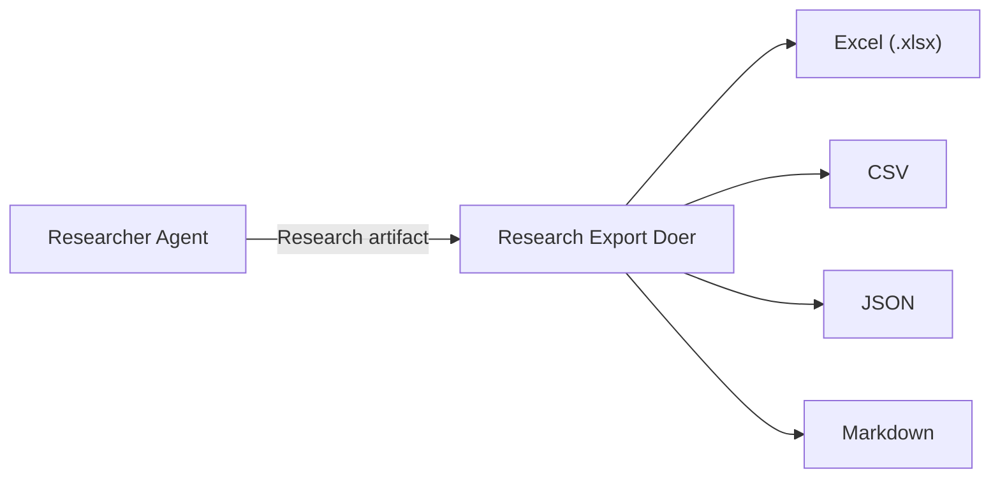

# Research & Export

The Research Export Doer converts research artifacts produced by Researcher agents into structured output formats suitable for downstream consumption, sharing, and archival.

## Overview

When a Researcher agent completes a research task, the output is a structured research summary. The Research Export Doer takes that summary and transforms it into one or more output formats:



## Supported Formats

| Format | Extension | Use Case |
|--------|----------|----------|
| **Excel** | `.xlsx` | Structured reports with styled headers, auto-sized columns |
| **CSV** | `.csv` | Machine-readable tabular data for pipelines |
| **JSON** | `.json` | Structured data for API consumption or further processing |
| **Markdown** | `.md` | Human-readable reports for documentation or wikis |

## Workflow

1. The Research Export Doer subscribes to `tasks.pending` with role filtering.
2. When it receives a research export task, it reads the source artifact from the task spec.
3. It parses the research content and transforms it into the requested format(s).
4. The exported file is saved to the workspace and submitted as an artifact to `artifacts.review`.
5. A Reflector validates the export (schema check, content integrity) before approval.

## Output Structure

### Excel Output

Excel exports include:

- **Styled headers** with bold formatting and background colors.
- **Auto-sized columns** that adjust to content width.
- **Data validation** ensuring numeric fields contain numbers and dates are properly formatted.
- **Multiple sheets** when the research contains distinct data categories.

### CSV Output

CSV exports follow RFC 4180:

- UTF-8 encoding with BOM for Excel compatibility.
- Quoted fields when content contains commas or newlines.
- Header row matching the research artifact's field names.

### JSON Output

JSON exports produce structured objects:

```json
{
  "metadata": {
    "task_id": "abc123",
    "source_artifact": "research-456",
    "exported_at": "2026-04-13T10:00:00Z",
    "format_version": "1.0"
  },
  "data": [
    {
      "title": "Finding 1",
      "summary": "...",
      "confidence": 0.92,
      "references": ["https://..."]
    }
  ]
}
```

### Markdown Output

Markdown exports produce structured documents with:

- YAML frontmatter containing metadata.
- Hierarchical headings matching the research structure.
- Tables for tabular data.
- Citation links at the bottom.

## Usage

### Via CLI

Submit a research export goal through the standard workflow:

```bash
caof run --goal "Export the transformer attention research to Excel format"
```

The Reasoning Agent decomposes this into research and export sub-tasks, assigning them to the appropriate agents.

### Programmatic

You can also use the export module directly from Python:

```python
from agents.shared.export import export_research

# Export to Excel
export_research(
    data=research_results,
    format="xlsx",
    output_path="output/research_report.xlsx"
)

# Export to multiple formats
for fmt in ["xlsx", "csv", "json", "md"]:
    export_research(
        data=research_results,
        format=fmt,
        output_path=f"output/research_report.{fmt}"
    )
```

## Source Files

| File | Purpose |
|------|---------|
| `agents/doers/research_export.py` | ResearchExportDoer agent |
| `agents/shared/export.py` | Format-agnostic export utilities |
