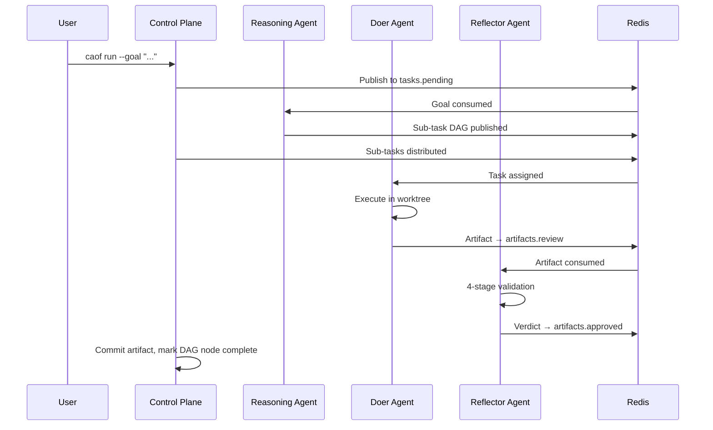

# Quick Start

**What you will build**: A complete agent workflow that decomposes a goal into sub-tasks, executes them with specialized agents, validates the output, and commits the results.

**Time estimate**: 10 minutes.

**Prerequisites**:

- [x] CAOF installed and `./bin/caof --help` working ([Installation](installation.md))
- [x] Redis running locally (`redis-cli ping` returns `PONG`)

---

## Step 1: Bootstrap the Workspace

Initialize a new CAOF workspace. This creates the directory structure, starts tmux sessions, and registers the Control Plane with Redis.

```bash
caof init --workspace ~/my-workspace
```

This command:

1. Validates all system dependencies (Go, Python, Redis, Git, tmux).
2. Starts a local Redis instance if one is not already running.
3. Creates the initial tmux session layout with Control Plane and monitor panes.
4. Initializes the Git repository and base worktree structure.
5. Loads the default configuration from `config/defaults.yaml`.

!!! info "Workspace location"
    The `--workspace` flag sets the root directory for all CAOF operations, including git worktrees and agent working directories. You can point this anywhere on your filesystem.

## Step 2: Spawn Agents

Spawn at least one doer agent and one reviewer agent. Each agent starts in its own tmux session and automatically registers with the Control Plane.

```bash
# Spawn a coder agent
caof spawn --role=coder

# Spawn a reviewer agent
caof spawn --role=reviewer
```

You can also specify which inference provider and model an agent should use:

```bash
caof spawn --role=coder --model=llama-local --session=coder-01
```

Available roles:

| Role | Agent Type | Capabilities |
|------|-----------|-------------|
| `coder` | Doer | File I/O, code execution sandbox, git operations |
| `researcher` | Doer | Web search, RAG retrieval, citation tools |
| `reviewer` | Reflector | Reflection loop, diff auditing, consensus voting |
| `planner` | Reasoning | CoT/ToT reasoning, DAG modification privileges |

## Step 3: Submit a Goal

Submit a natural-language goal. The Control Plane decomposes it into a DAG of sub-tasks and distributes them to the agent pool.

```bash
caof run --goal "Write a sorting algorithm in Python"
```

Behind the scenes, this triggers the full task lifecycle:

1. A Reasoning Agent decomposes the goal into sub-tasks.
2. The Scheduler assigns sub-tasks to available agents by role.
3. Doer agents execute tasks in isolated git worktrees.
4. Reflector agents validate each artifact through the 4-stage pipeline.
5. Approved artifacts are committed to the repository.

## Step 4: Monitor Progress

Check the status of your agents and the task DAG:

```bash
# Show agent status and task DAG
caof status --dag
```

For more detail:

```bash
caof status --dag --verbose
```

You can also attach to any agent's tmux session to watch it work in real time:

```bash
tmux attach -t caof-coder-01
```

!!! tip "Detaching from tmux"
    Press `Ctrl+B` then `D` to detach from a tmux session without stopping the agent.

## Step 5: Review the Results

Once the DAG completes, inspect the committed artifacts in your workspace:

```bash
cd ~/my-workspace
git log --oneline -10
```

Each approved artifact is committed with metadata referencing the originating task ID and the Reflector verdict.

## What Happened

Here is the sequence of events that CAOF executed:



## Tearing Down

When you are done, clean up all tmux sessions and worktrees:

```bash
caof teardown --force
```

## Next Steps

- [Architecture Overview](../architecture/overview.md) -- Understand how all the pieces fit together.
- [Agent System](../components/agents.md) -- Learn about the different agent types and their capabilities.
- [Configuration Reference](../reference/configuration.md) -- Customize inference providers, timeouts, and stream names.
