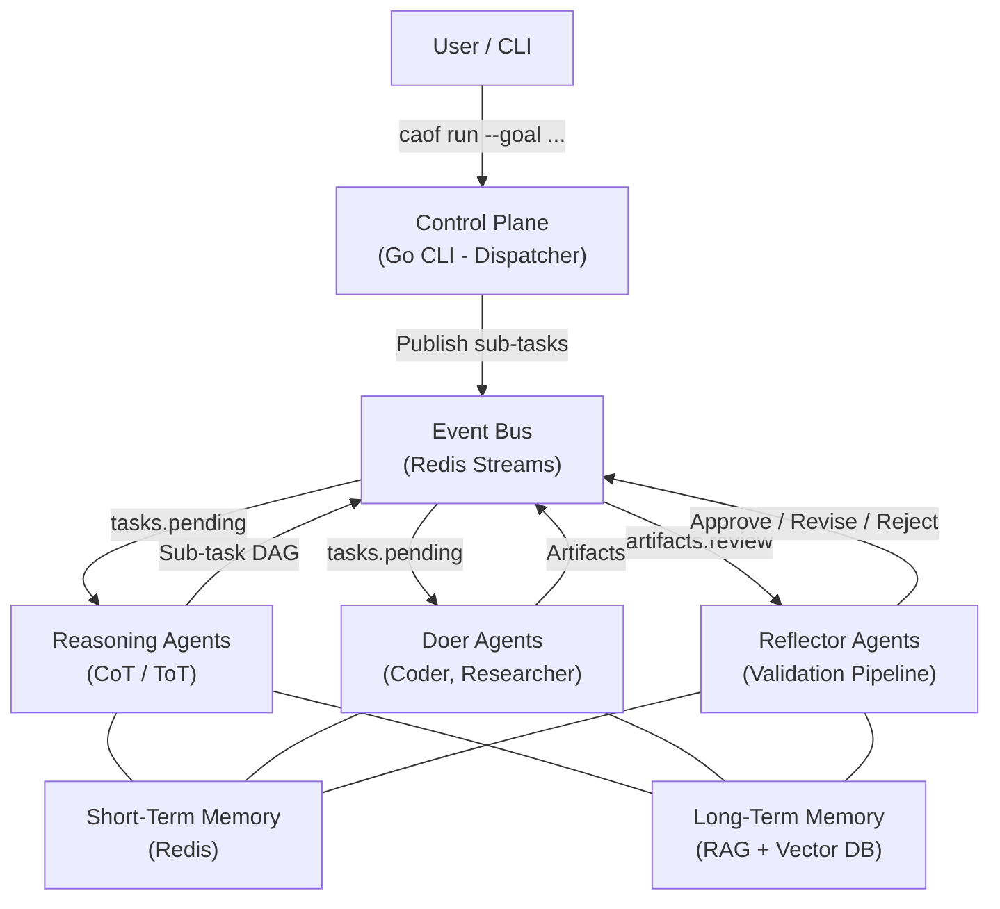

# CAOF -- Collective Agentic Orchestration Framework

> A multi-agent architecture for persistent, modular, and self-correcting R&D workflows.

---

## What is CAOF?

CAOF is a **Controller/Worker multi-agent system** that treats agents as specialized, persistent service nodes rather than steps in a linear prompt chain. Each agent operates independently, manages its own state, and communicates through a central event bus. The system is built for local-first execution, inference-provider portability, and human-in-the-loop oversight.

You submit a high-level research or engineering goal, and CAOF decomposes it into a directed acyclic graph (DAG) of sub-tasks, assigns those tasks to specialized agents, validates every output through a reflection pipeline, and commits approved artifacts to your repository.

## Key Features

- **Modular agents** -- Each agent is a self-contained service with a single responsibility (reasoning, coding, reviewing, researching).
- **Persistence via tmux** -- Agent processes survive terminal disconnection and can be reattached at any time.
- **Isolation via git worktrees** -- Parallel coding tasks execute in separate worktree sandboxes, preventing conflicts.
- **Inference portability** -- Swap between local Llama, Anthropic, or OpenAI with a config change. No vendor lock-in.
- **Human-in-the-loop** -- Automatic escalation when agents get stuck, with tmux-based operator intervention and a `caof resume` workflow.
- **Self-correcting validation** -- Every artifact passes through a 4-stage reflection pipeline before it is committed.

## Architecture at a Glance



## Quick Start

```bash
# Clone and build
git clone https://github.com/danielckv/agentic-orchestration.git
cd agentic-orchestration
make build

# Bootstrap workspace
./bin/caof init --workspace ~/my-workspace

# Spawn agents
./bin/caof spawn --role=coder
./bin/caof spawn --role=reviewer

# Submit a goal
./bin/caof run --goal "Write a sorting algorithm in Python"

# Monitor progress
./bin/caof status --dag
```

!!! tip "New to CAOF?"
    Head to the [Installation](getting-started/installation.md) guide first, then follow the [Quick Start](getting-started/quickstart.md) tutorial to run your first goal end-to-end.

## Technology Stack

| Layer | Technology |
|-------|-----------|
| Orchestration CLI | Go 1.22+ (Cobra, go:embed) |
| Event Bus | Redis 7+ (Streams, Pub/Sub, KV) |
| Agent Runtime | Python 3.11+ (Pydantic, httpx) |
| Vector Database | Provider-agnostic (Qdrant, Milvus, or FAISS) |
| Process Management | tmux 3.3+ |
| Version Control | Git 2.40+ (worktrees) |
| Build System | GNU Make |

## Project Status

All four implementation phases are complete with core feature tests passing.

| Phase | Description | Status |
|-------|-------------|--------|
| P1: Foundation | Scaffolding, CLI, event bus, agent base, registry, tmux/worktree | Done |
| P2: Intelligence | Inference providers, reasoning/doer/reflector agents, memory layer | Done |
| P3: Orchestration | DAG engine, scheduler, consensus, HITL, validation, research export | Done |
| P4: Hardening | Metrics, structured logging, health monitor, resilience, retry, deadlock detection | Done |
