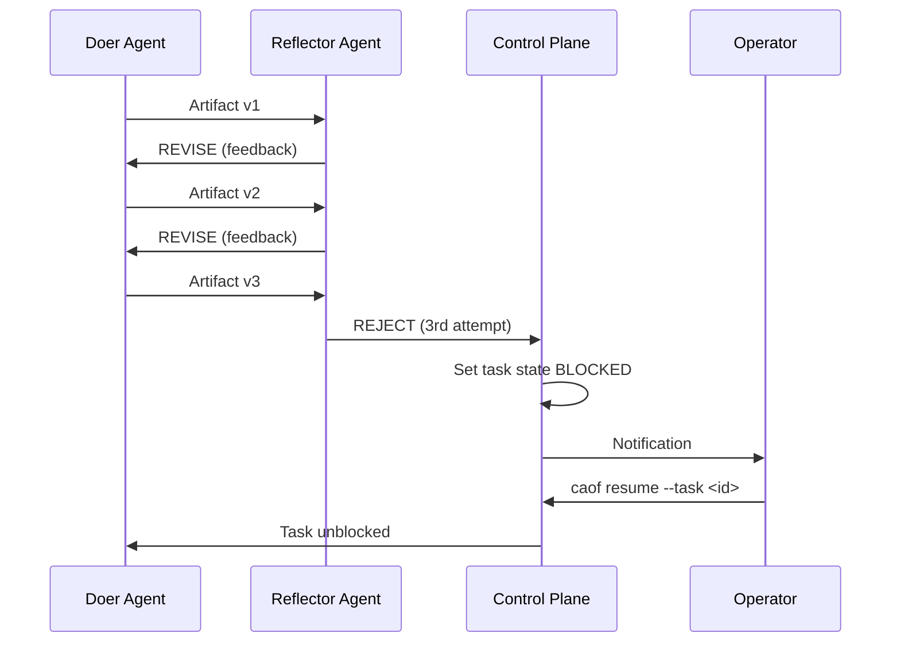

# Human-in-the-Loop

CAOF is designed for autonomous operation, but it includes deliberate escalation points where human judgment is required. The human-in-the-loop (HITL) system ensures that agents do not spin endlessly on unsolvable problems.

## When Escalation Happens

### Rejection Threshold

The primary trigger is **3 consecutive Reflector rejections** on the same task. This indicates that the Doer agent is unable to produce an acceptable artifact despite receiving feedback.



### Other Escalation Triggers

| Trigger | Condition | Action |
|---------|-----------|--------|
| Repeated rejections | 3 consecutive rejections by Reflector | Task blocked, operator notified |
| Git merge conflict | Worktree merge fails | DAG branch paused, conflict flagged |
| DAG deadlock | Circular dependency detected at runtime | Affected branch paused |
| Consensus tie | Voting panel cannot reach majority | Decision deferred to operator |

## Notification System

When a task is escalated, the Control Plane alerts the operator through the tmux notification system:

1. **Terminal bell** -- The tmux session containing the blocked agent triggers a visual/audio bell.
2. **Session marker** -- The tmux window name is updated to include a `[BLOCKED]` indicator.
3. **Status command** -- `caof status` highlights blocked tasks prominently.

```bash
# Check for blocked tasks
caof status --dag

# Output includes:
# BLOCKED  task-abc123  "Implement sorting algorithm"  (3 rejections, awaiting operator)
```

!!! info "External notifications"
    Webhook and Slack notifications are planned for a future release. Currently, operators should monitor the `caof status` output or keep the Control Plane tmux session visible.

## Operator Intervention

### Inspect the Problem

Attach to the agent's tmux session to see the full context:

```bash
# See which tasks are blocked
caof status --dag --verbose

# Attach to the agent that was working on the blocked task
tmux attach -t caof-coder-01
```

Inside the tmux session, you can:

- Read the agent's logs to understand what went wrong.
- Inspect the worktree where the agent was working.
- Review the Reflector's feedback from each revision round.

### Provide Guidance

You have several options:

1. **Edit the artifact directly** in the agent's worktree and signal resume.
2. **Modify the task spec** to clarify requirements or relax constraints.
3. **Reassign the task** to a different agent or role.
4. **Cancel the task** if it is no longer needed.

### Resume the Task

Once you have addressed the issue, unblock the task:

```bash
caof resume --task <task-id>
```

This command:

1. Sets the task state from `blocked` back to `running`.
2. Resets the rejection counter to 0.
3. Notifies the assigned agent to retry.
4. Logs the HITL intervention with a timestamp and the operator's action.

## Consensus Voting

For critical decisions that affect the overall direction of a goal (architectural changes, strategy pivots, conflicting research findings), the system convenes a **Panel of Experts**.

### How Voting Works

1. The Control Plane detects a decision point (e.g., multiple viable approaches from a Tree-of-Thought decomposition).
2. It publishes a decision context to `consensus.votes` with the available options.
3. A minimum of 3 agents (odd count) are selected as voters.
4. Each agent evaluates the options independently and submits a vote with confidence and rationale.
5. The majority wins. In case of a tie, the Reasoning Agent with the highest historical accuracy score breaks the tie.
6. The decision is recorded in long-term memory for future reference.

### Vote Message

```json
{
  "decision_id": "uuid-v4",
  "voter_agent_id": "researcher-01",
  "option_selected": "option_1",
  "confidence": 0.82,
  "rationale": "Based on RAG retrieval of prior experiments...",
  "references": ["rag://experiments/attn-pruning-run-7"]
}
```

### Governance Rules

- Consensus is required for any change touching the DAG structure after initial decomposition.
- A single Reflector rejection does not block -- it triggers a revision loop. Only 3 consecutive rejections escalate.
- Feature flags cannot be changed at runtime without a Control Plane restart (safety constraint).
- All decisions and their rationale are stored in long-term memory for auditability.

## Source Files

| File | Purpose |
|------|---------|
| `internal/dispatcher/hitl.go` | Rejection tracking, escalation, and resume logic |
| `internal/dispatcher/consensus.go` | Voting panel initiation, collection, and tallying |
