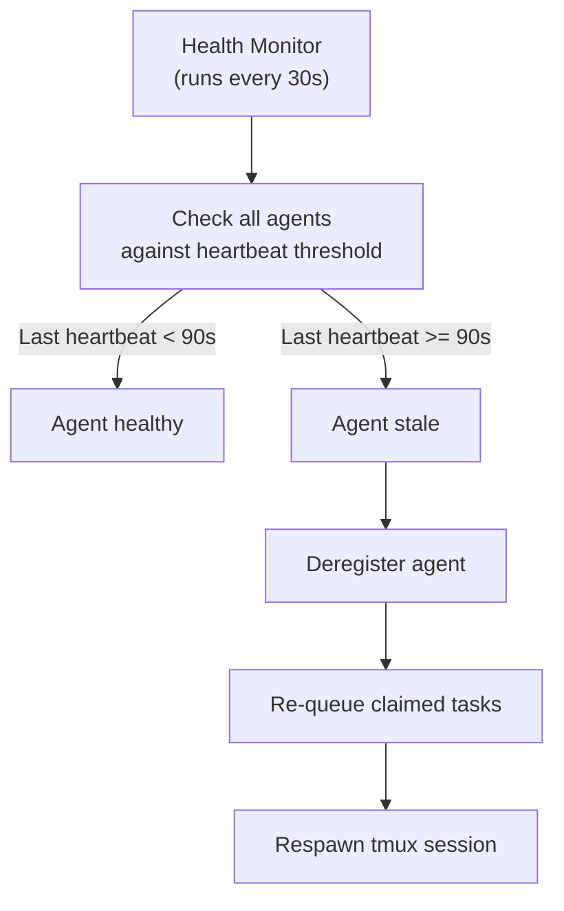

# Monitoring & Observability

CAOF provides three observability pillars: metrics, structured logging, and health monitoring. Together, these give you full visibility into agent activity, task progress, and system health.

## Prometheus Metrics

The Control Plane exposes a `/metrics` endpoint (on the registry port, default `9400`) in Prometheus exposition format.

### Available Metrics

| Metric | Type | Description |
|--------|------|-------------|
| `caof_tasks_total` | Counter | Total tasks created, labeled by `role` and `status` |
| `caof_tasks_active` | Gauge | Currently running tasks |
| `caof_tasks_completed` | Counter | Tasks that reached `complete` state |
| `caof_tasks_failed` | Counter | Tasks that were rejected or escalated |
| `caof_agents_registered` | Gauge | Number of agents currently registered |
| `caof_agents_active` | Gauge | Agents currently executing a task |
| `caof_task_duration_seconds` | Histogram | Time from task claim to completion |
| `caof_reflection_duration_seconds` | Histogram | Time spent in the reflection pipeline |
| `caof_revision_count` | Histogram | Number of revision loops per task |
| `caof_heartbeat_lag_seconds` | Gauge | Time since last heartbeat per agent |

### Scrape Configuration

Add CAOF to your Prometheus configuration:

```yaml
scrape_configs:
  - job_name: 'caof'
    static_configs:
      - targets: ['localhost:9400']
    scrape_interval: 15s
```

### Example Queries

```promql
# Task completion rate over the last hour
rate(caof_tasks_completed[1h])

# Average task duration by role
histogram_quantile(0.95, rate(caof_task_duration_seconds_bucket[5m]))

# Agents that haven't sent a heartbeat in 60 seconds
caof_heartbeat_lag_seconds > 60
```

## Structured Logging

All CAOF components emit structured JSON logs with correlation IDs for end-to-end traceability.

### Log Format

```json
{
  "timestamp": "2026-04-13T10:05:23.456Z",
  "level": "info",
  "component": "scheduler",
  "correlation_id": "goal-abc123",
  "task_id": "task-def456",
  "agent_id": "coder-01",
  "message": "Task assigned to agent",
  "metadata": {
    "role": "coder",
    "dag_depth": 2,
    "priority": "high"
  }
}
```

### Correlation IDs

Every goal submission generates a correlation ID that propagates through:

- All sub-tasks in the DAG
- All event bus messages related to those tasks
- All agent logs while processing those tasks
- All reflection verdicts

This allows you to trace a single goal from submission to completion across all components.

### Log Levels

| Level | Usage |
|-------|-------|
| `debug` | Detailed internal state, message payloads, retry attempts |
| `info` | Normal operations: task assignment, artifact submission, DAG progression |
| `warn` | Recoverable issues: retry exhaustion, slow consumers, high load |
| `error` | Failures: agent crash, Redis disconnect, deadlock detected |

### Viewing Logs

Agent logs are available in their tmux sessions:

```bash
# Attach to an agent's session to see live logs
tmux attach -t caof-coder-01

# Or tail the log file directly
tail -f ~/caof-workspace/logs/coder-01.log
```

!!! tip "Filtering with jq"
    Since logs are structured JSON, you can filter them with `jq`:
    ```bash
    tail -f logs/coder-01.log | jq 'select(.level == "error")'
    tail -f logs/coder-01.log | jq 'select(.correlation_id == "goal-abc123")'
    ```

## Health Monitor

The health monitor runs inside the Control Plane and continuously checks agent liveness.

### Stale Detection

An agent is considered **stale** if its last heartbeat exceeds the configured threshold:

```yaml
heartbeat:
  interval_seconds: 30
  stale_threshold_seconds: 90
```

- Agents send heartbeats every 30 seconds.
- If no heartbeat is received for 90 seconds, the agent is marked stale.
- Stale agents are deregistered and their claimed tasks are returned to the pending pool.

### Auto-Respawn

When a stale agent is detected, the health monitor can automatically respawn it:

1. The stale agent's tmux session is killed.
2. A new tmux session is created with the same role and configuration.
3. The new agent registers with the Control Plane.
4. Any tasks that were claimed by the old agent are re-queued.

!!! warning "Data loss on crash"
    If an agent crashes mid-execution, any in-progress work that was not yet submitted as an artifact is lost. The task is re-queued and a new agent starts from scratch. Design tasks to be small and atomic to minimize the blast radius.

### Health Check Flow



## Failure Mode Summary

| Failure | Detection Method | Automated Response |
|---------|-----------------|-------------------|
| Agent process crash | Missing heartbeat | Deregister, re-queue tasks, respawn |
| Redis unavailable | Connection error on publish/subscribe | Local buffering, exponential backoff reconnection |
| Inference timeout | Request exceeds `timeout_seconds` | Retry with backoff, fall back to secondary provider |
| DAG deadlock | Cycle detection algorithm | Pause affected branch, escalate to operator |
| Infinite revision loop | Revision count exceeds `max_revisions` (3) | Escalate to human-in-the-loop |

## Source Files

| File | Purpose |
|------|---------|
| `internal/dispatcher/metrics.go` | Prometheus metric definitions and exposition |
| `internal/dispatcher/logger.go` | Structured JSON logging with correlation IDs |
| `internal/dispatcher/health.go` | Health monitor with stale detection and auto-respawn |
